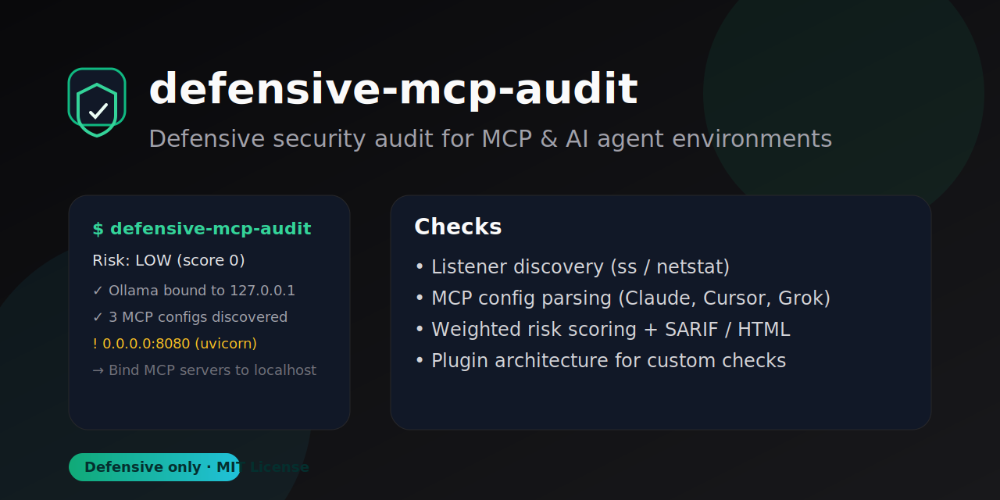

<p align="center">
  
</p>

<h1 align="center">defensive-mcp-audit</h1>

<p align="center">
  <strong>Defensive security audit for AI Agent & MCP environments</strong><br>
  Detect risky localhost exposure, weak bindings, and confused-deputy risks — with zero offensive capability.
</p>

<p align="center">
  <a href="https://github.com/Stijnman/defensive-mcp-audit/actions/workflows/defensive-mcp-audit.yml"></a>
  <a href="https://github.com/Stijnman/defensive-mcp-audit/releases/latest"></a>
  <a href="LICENSE"></a>
  <a href="https://www.python.org/downloads/"></a>
</p>

<p align="center">
  
</p>

---

## Why this exists

MCP security research (2025–2026) showed that local MCP servers are often accidentally exposed via `0.0.0.0` bindings or reachable through DNS rebinding — enabling confused-deputy and drive-by attacks on developer machines.

This tool gives you a **fast, actionable, defensive-only** audit of those risks on your own machine.

## Features

| Capability | Description |
|------------|-------------|
| Listener discovery | `ss` on Linux, `netstat` fallback elsewhere |
| Smart classification | MCP-related vs system vs unknown processes |
| Weighted scoring | Samba ≠ MCP — fewer false CRITICAL alerts |
| MCP config scan | Claude, Cursor, VS Code, Grok, `.mcp.json` |
| Output formats | Terminal, JSON, SARIF, self-contained HTML |
| CI-ready | GitHub Action + weekly SARIF workflow included |
| Extensible | Plugin checks in `checks/` |

## Quick start

```bash
git clone https://github.com/Stijnman/defensive-mcp-audit.git
cd defensive-mcp-audit
pip install -e ".[cli]"

python -m defensive_mcp_audit
python -m defensive_mcp_audit --format html -o audit-report.html
python -m defensive_mcp_audit --format sarif -o results.sarif
```

### Example output

```
Risk: HIGH (65)

Findings:
  [medium] UNKNOWN_EXPOSED_LISTENER — Unclassified 0.0.0.0 bindings
  [info]   MCP_LOCALHOST_OK         — Ollama on 127.0.0.1:11434
  [info]   SYSTEM_EXPOSED_LISTENER  — smbd on 0.0.0.0:445 (informational)
```

## Install

```bash
# From source (recommended today)
pip install "git+https://github.com/Stijnman/defensive-mcp-audit@v0.3.1#egg=defensive-mcp-audit[cli]"

# After PyPI publish
pip install defensive-mcp-audit[cli]
```

## Python API

```python
from defensive_mcp_audit import audit_mcp_environment, generate_sarif, generate_html_report

report = audit_mcp_environment()
print(report["risk_level"], report["risk_score"])
```

## GitHub Action (one-click CI)

Add to any workflow:

```yaml
- uses: Stijnman/defensive-mcp-audit/action@v0.3.1
  with:
    upload-sarif: "true"
```

Or run the full workflow — see [`.github/workflows/defensive-mcp-audit.yml`](.github/workflows/defensive-mcp-audit.yml).

## Finding reference

| ID | Severity | Meaning |
|----|----------|---------|
| `MCP_EXPOSED_NON_LOCALHOST` | high | MCP-related service on `0.0.0.0` — fix immediately |
| `UNKNOWN_EXPOSED_LISTENER` | medium | Unclassified `0.0.0.0` listener — review |
| `SYSTEM_EXPOSED_LISTENER` | info | OS service (e.g. Samba) — noted, low MCP impact |
| `MCP_CONFIG_RISK` | medium | Risky patterns in MCP client config |
| `CONFUSED_DEPUTY_RISK` | medium/high | Local MCP surface + agent/browser trust boundary |

## Project structure

```
defensive-mcp-audit/
├── defensive_mcp_audit/     # Core package
├── checks/                  # Plugin checks
├── action/                  # Composite GitHub Action
├── tests/
├── SKILL.md                 # Agent skill integration
└── .github/
```

## Development

```bash
pip install -e ".[dev]"
python -m unittest discover -s tests -v
```

See [CONTRIBUTING.md](CONTRIBUTING.md) and [SECURITY.md](SECURITY.md).

## Roadmap

- [x] Plugin architecture (#1)
- [x] MCP config discovery (#2)
- [x] Composite GitHub Action
- [ ] PyPI publish
- [ ] Docker / container runtime inspection
- [ ] Historical risk trending

## Ethics

Strictly **defensive**. Read-only inspection. No exploitation, payloads, or network attacks.

## License

MIT — see [LICENSE](LICENSE).